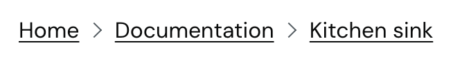
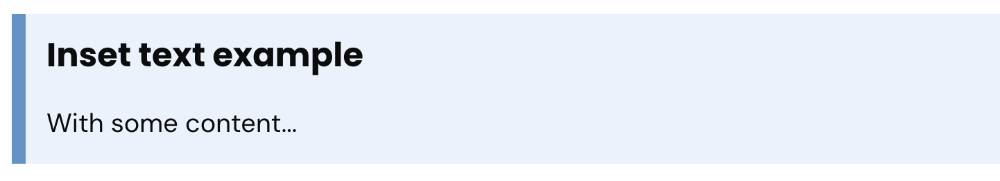

# Using components
## Overview

### Accordion

| Components	      | Children| Properties | Default properties |
|------------------|---------|------------|--------------------|
| Accordion        | 	   AccordionSection | none       | none               |
| AccordionSection | 	       any | title	     | "                  |

```mdxjs
<Accordion>
    <AccordionSection title={'Project structure'}>
        This is the content for Project structure.
    </AccordionSection>
    <AccordionSection title={'Project compliance'}>
        This is the content for Project structure.
    </AccordionSection>
</Accordion>
```
### Back link

| Components | Children | Properties     | Default properties    | Required  |
|------------|----------|----------------|-----------------------|-----------|
| BackLink   | none     | title<br/>href | Back<br/>browser back | no<br/>no |

```mdxjs
<BackLink href='/some-destination' title='Back' />
```
### Breadcrumbs
The Breadcrumbs component differs to all other components as it is configured via the 
[frontmatter](/docs/2_Content.md#frontmatter) of the document. Add a `breadcrumbs` attribute 
to the frontmatter with a list of titles and links separated by a comma `Home, /` (see complete 
example below)

**N.B. The current page is automatically included in the crumbs and should not be added to the 
frontmatter**



```yaml
---
title: Kitchen sink
description: All the components in one place
priority: Now
value: High value
complexity: High complexity
product: Leavers
tags:
 - High value
 - High priority
breadcrumbs:
  - 'Home, /'
  - 'Documentation, /documentation/'
```

### Button component

```mdxjs
<Button label='Save and continue'  className='govuk-button-background-colour govuk-button-text-colour'>{label}</Button>
```


### Details component
| Components | Children | Properties | Default properties   | Required |
|------------|----------|-------|----------------------|----------|
| Details    | any      | title | "" | yes      |
```mdxjs
<Details title={'A details component'}>
  Some  contents for the details component...
</Details>
```
### Facetted search
TODO

### Layout - GridRow, GridColumn
There are only two components required to create layouts of varying widths, GridRow and 
GridColumn. 

**GridColumn widths**: 1/4, 1/3, 1/2, 2/3, 3/4, full

| Components | Children   | Properties | Default properties | Required |
|------------|------------|------------|--------------------|----------|
| GridRow    | GridColumn | none       | none               | n/a      |
| GridColumn | any        | width | 2/3 | yes      |
```mdxjs
<GridRow>
  <GridColumn width="2/3">
    Column content and components go here!
  </GridColumn>
  <GridColumn width="1/3">
    Column content and components go here!
  </GridColumn>
</GridRow>
```
### Heading
This component is only intended for custom typography headings with a caption. Markdown syntax will 
better suit all other use cases. 

**Tag values**: h1, h2, h3, h4

| Components | Children | Properties                      | Default properties                 | Required           |
|------------|----------|---------------------------------|------------------------------------|--------------------|
| Heading    | any      | tag,<br/>caption,<br/>className | h1,<br/>none,<br/>govuk-heading-xl | yes<br/>yes<br/>no |

```mdxjs
<Heading caption='A caption for extra flair' tag='h1' className='govuk-caption-xl'>The Kitchen Sink</Heading>
```


### Images
See images in the [Markdown Guide](https://www.markdownguide.org/basic-syntax/#images-1)

### Inset text
| Components | Children | Properties | Default properties | Required |
|------------|----------|------------|--------------------|---------|
| InsetText  | any      | none       | n/a                | n/a     |

```mdxjs
<InsetText>
  ### Inset text example
  With some content...
</InsetText>
```


### LeadParagraph
| Components | Children | Properties | Default properties | Required |
|------------|----------|------------|--------------------|---------|
| LeadParagraph  | any      | none       | n/a                | n/a     |
```mdxjs
<LeadParagraph>
  Some text in a <b>lead paragraph</b> component to help you content stand out.
</LeadParagraph>
```

### Pagination
TODO

### Sortable List
**Data Integration** - Ensure proper data integration by following the guidelines in [Working with data](docs/4_Data.md)
#### SortBy property structure
The sortBy property provides flexibility by allowing you to choose key(s) from your data for sorting.

The sortBy property utilises double curly braces `{{ }}` to define keys and values for sorting data.

-  Specify the key(s) for sorting your data.<br />**Example**: `chosenKey: 
   ['chosenValue1','chosenValue2', 'chosenValue3'],`
- Ensure each key-value pair is followed by a comma except the last (follow example below)

Ensure you adhere to the specified structure for the sortBy property when implementing the Sortable Lists component.

#### Other properties
- **linkField:** Field in the data containing the URL for linking list items (optional).
- **titleField:** Field in the data with content to display in the list.
- **sortText:** Label text displayed above the sorting select box in the lists.

| Components | Children | Properties                                          | Default properties                     | Required                     |
|------------|----------|-----------------------------------------------------|----------------------------------------|------------------------------|
| SortableLists  | none     | titleField,<br/>linkField,<br/>sortBy,<br/>sortText<br/> | title,<br/>none,<br/>none,<br/>Sort by | yes,<br/>no,<br/>yes,<br/>no |

```mdxjs
<ReadData where={"slug:features"}>
  <SortableLists
    linkField="url"
    titleField="title"
    sortBy={{
      chosenKey: ['chosenValue1','chosenValue2', 'chosenValue3'],
      chosenKey1: ['chosenValue1', 'chosenValue2'],
      chosenKey2: ['chosenValue1', 'chosenValue2']
    }}/>
</ReadData>
```
### SummaryList

### Table

| Components  | Children                  | Properties | Default properties | Required |
|-------------|---------------------------|------------|--------------------|-----|
| Table       | TableHeader,<br/>TableRow | caption    | none               | no  |
| TableHeader | TableCell                 | none       | n/a | yes |
| TableRow    | TableCell                 | none       | n/a | yes |

#### Manual construction
```mdxjs
<Table>
    <TableHeader>
      <TableCell>Header 1</TableCell><TableCell>Header 2</TableCell>
    </TableHeader>
  <TableRow>
    <TableCell>Body 1</TableCell><TableCell>Body 2</TableCell>
  </TableRow>
</Table>
```
### Tag component

